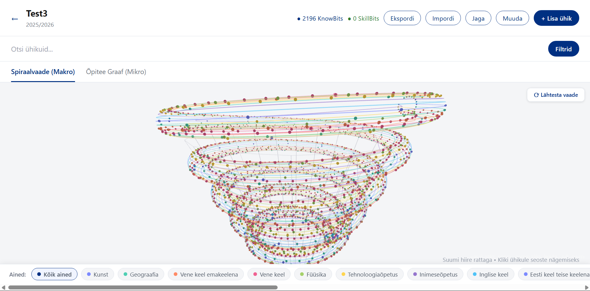
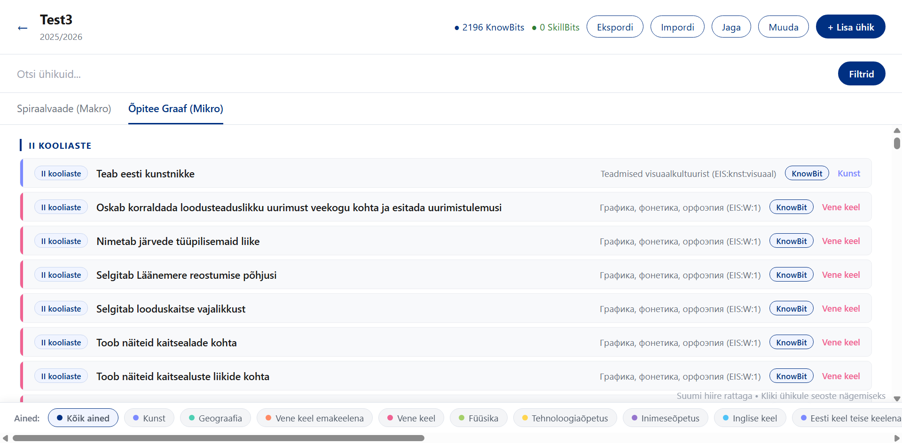
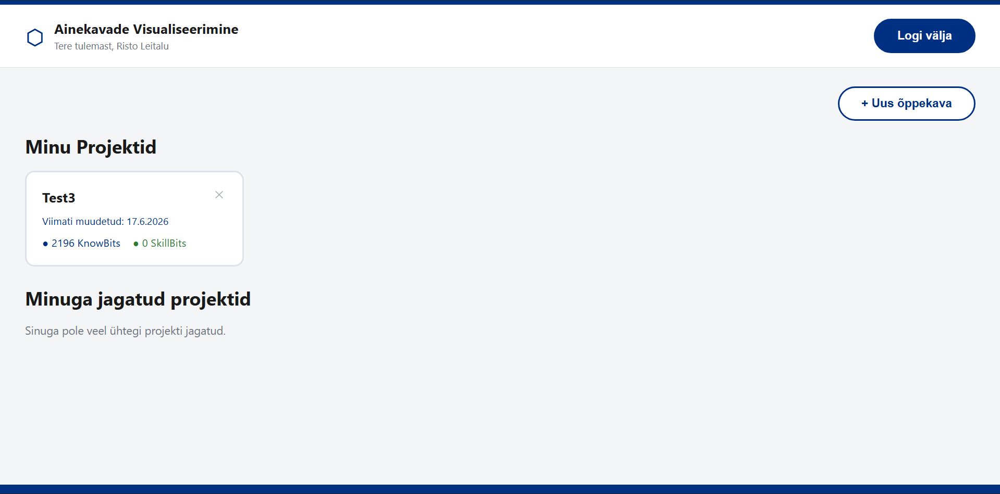

<div align="center">

# Õpiteede visualiseerimine

**Interaktiivne veebirakendus riiklike õppekavade visualiseerimiseks ajas arenevate spiraalide ja õpitee-graafidena.**

[Demo](https://opiteede-visualiseerimine-uvhe.onrender.com) · [Veateated ja ideed](../../issues)

</div>

---

## Ekraanipildid

| Spiraalvaade (makro) | Õpitee-graaf (mikro) |
|:---:|:---:|
|  |  |

| Töölaud (õppekavade haldus) |
|:---:|
|  |

---

## Eesmärk ja lühikirjeldus

Õpetajatel ja õppekavade koostajatel on raske näha, **kuidas teemad õppeastmete lõikes korduvad, süvenevad ja üksteisest sõltuvad** — staatiline tekstiline õppekava ei näita neid seoseid. See rakendus muudab staatilise õppekava (JSON-LD, JSON) **interaktiivseks graafiks**: spiraalvaade näitab õpiteid ajas arenevate spiraalidena (teemad korduvad ja süvenevad kooliastmeti), õpitee-graaf aga ühe konkreetse teema eeltingimusi ja väljundeid. Kasutaja saab õppekavasid importida, redigeerida, filtreerida, otsida, kõrvutada ning teistega jagada. Andmemudeli põhiühikud on **KnowBit** (teadmusühik) ja **SkillBit** (soorituspõhine oskus).

---

## Kelle ja mille raames

Rakendus on loodud **Tallinna Ülikooli Digitehnoloogiate instituudi** kursuse **„Tarkvaraarenduse projekt" (IFIFB/25.DT)** arendusprojektina (Meeskond 10). Projekt järgib kasutajakeskse disaini protsessi ning seda on valideeritud Hi-Fi prototüübi kasutajatestidega (20 kasutajat, AttrakDiff).

---

## Autorid (Meeskond 10)

- **Marcus Haljasoks** (meeskonna juht)
- Risto Leitalu
- Markus Prokuda
- Sten Kreek
- Uku Siim Kurm

---

## Kasutatud tehnoloogiad ja versioonid

### Backend
| Tehnoloogia | Versioon |
|---|---|
| Java | 21 |
| Spring Boot (starter-parent) | 4.0.6 |
| Spring Web MVC / Data JPA / Security / Mail / Validation | 4.0.6 (Boot-iga) |
| io.jsonwebtoken **jjwt** (api / impl / jackson) | 0.12.6 |
| H2 (arendus, in-memory) | Boot-i hallatud |
| PostgreSQL (tootmine) | Boot-i hallatud |
| Jackson (databind + jsr310) | Boot-i hallatud |
| Lombok | Boot-i hallatud |
| Maven (wrapper `mvnw`) | 3.9.6 (Docker build) |

### Frontend
| Tehnoloogia | Versioon |
|---|---|
| React / React DOM | 19.2.4 |
| React Router DOM | 7.17.0 |
| Vite | 8.0.0 |
| Firebase (Auth + Firestore) | 12.14.0 |
| three.js | 0.184.0 |
| ESLint | 9.39.4 |

### Taristu
- **Docker** (multi-stage: `maven:3.9.6-eclipse-temurin-21` → `eclipse-temurin:21-jre`)
- Hostimine: **Render** (backend + frontend)

---

## Põhifunktsioonid

- Spiraalvaade (makro) ja õpitee-graaf (mikro), hover-info ja sisse/välja suumimine
- Import/eksport: **JSON, JSON-LD**
- Filtreerimine kooliastme ja valdkonna kaupa, otsing
- Õppekavade loomine, muutmine ja **jagamine** (vaataja / kaasautor / admin)
- Avalik jagamislink anonüümseks vaatamiseks
- Märkmed teemadele, lugemisrežiim
- Google'i kontoga sisselogimine (Firebase), backend väljastab JWT

---

## Arhitektuur

```
opiteede_projekt/
├── backend_opiteed/        # Spring Boot REST API (port 8090)
│   ├── src/main/java/ee/opiteed/tlu_opiteed/
│   │   ├── controller/     # REST-otspunktid
│   │   ├── service/        # äriloogika
│   │   ├── repository/     # Spring Data JPA
│   │   ├── entity/         # JPA-olemid (DB-tabelid)
│   │   ├── security/       # JwtAuthFilter, JwtUtil
│   │   └── config/         # SecurityConfig, CORS
│   ├── src/main/resources/ # application*.properties
│   └── Dockerfile
└── frontend/               # React + Vite SPA
    ├── src/
    │   ├── pages/          # HomePage, LoginPage, Dashboard, NewCurriculum, ...
    │   ├── api.js          # apiFetch (JWT-päised)
    │   ├── auth.js         # Google login + JWT hankimine
    │   └── firebaseConfig.jsx
    ├── .env.dev / .env.prod
    └── vite.config.js
```

Autentimine: kasutaja logib Google'iga sisse (Firebase) → frontend saadab `POST /api/auth/firebase` → backend väljastab **HMAC-allkirjastatud JWT** (kehtivus 24h), mida hoitakse `localStorage`-is ja saadetakse `Authorization: Bearer <token>` päises. Backend on **stateless** (`SessionCreationPolicy.STATELESS`).

---

## Paigaldus ja arenduskeskkonna ülesseadmine

### Eeltingimused

- **Java 21** (JDK)
- **Node.js 20+** ja npm
- (Valikuline tootmiseks) **PostgreSQL 14+**
- (Valikuline) **Docker**
- Firebase'i projekt, kus on lubatud Google'i autentimine

> Arenduses kasutab backend vaikimisi **H2 in-memory** andmebaasi — PostgreSQL-i ei ole vaja installida, et rakendus käima saada.

### 1. Klooni repo

```bash
git clone <repo-url>
cd opiteede_projekt
```

### 2. Backend (Spring Boot, port 8090)

```bash
cd backend_opiteed

# Käivita arendusprofiiliga (H2 in-memory andmebaas)
./mvnw spring-boot:run "-Dspring-boot.run.profiles=dev"
# Windows PowerShell:
.\mvnw.cmd spring-boot:run "-Dspring-boot.run.profiles=dev"
```

Backend käivitub aadressil **http://localhost:8090**.
H2 konsool (arendus): **http://localhost:8090/h2-console** (JDBC URL `jdbc:h2:mem:opiteeddb`, kasutaja `sa`, parool tühi).

**Backendi keskkonnamuutujad** (vt `src/main/resources/application*.properties`):

```bash
# Kõik on valikulised — arenduses on olemas mõistlikud vaikeväärtused.
JWT_SECRET=<vähemalt-256-bitti-pikk-juhuslik-saladus>   # vaikimisi olemas, MUUDA tootmises!
MAIL_USERNAME=<gmaili-aadress>     # jagamiskutsete e-kirjade saatmiseks (valikuline)
MAIL_PASSWORD=<gmaili-rakenduseparool>
DB_PASSWORD=<postgresi-parool>     # ainult prod-profiilil
PORT=8090
```

### 3. Frontend (React + Vite)

```bash
cd frontend
npm install
npm run dev          # käivitab Vite arendusserveri (mode=dev), vaikimisi http://localhost:5173
```

Frontend loeb keskkonnamuutujad failidest `.env.dev` (arendus) ja `.env.prod` (build). Vajalikud muutujad:

```bash
VITE_BACK_URL=http://localhost:8090        # backendi aadress

# Firebase'i veebirakenduse konfiguratsioon (Firebase konsoolist)
VITE_FIREBASE_API_KEY=<sinu-firebase-api-key>
VITE_FIREBASE_AUTH_DOMAIN=<projekt>.firebaseapp.com
VITE_FIREBASE_PROJECT_ID=<projekt>
VITE_FIREBASE_STORAGE_BUCKET=<projekt>.firebasestorage.app
VITE_FIREBASE_MESSAGING_SENDER_ID=<sender-id>
VITE_FIREBASE_APP_ID=<app-id>
```

> Repos olevad `.env.dev` / `.env.prod` sisaldavad näidisprojekti Firebase'i väärtusi. Päris juurutuse jaoks loo **oma Firebase'i projekt** ja asenda väärtused. Veendu, et Firebase'i konsoolis on lubatud domeenid (localhost arenduseks).

### 4. Tootmis-build

```bash
# Frontend
cd frontend && npm run build      # väljund: frontend/dist/

# Backend (JAR)
cd backend_opiteed && ./mvnw clean package
java -jar target/tlu_opiteed-0.0.1-SNAPSHOT.jar --spring.profiles.active=prod

# või Docker
cd backend_opiteed && docker build -t opiteed-backend . && docker run -p 8080:8080 \
  -e JWT_SECRET=... -e DB_PASSWORD=... opiteed-backend
```

---

## Andmebaas

Arenduses (`dev`-profiil) kasutatakse **H2 in-memory** andmebaasi ja tootmises (`prod`-profiil) **PostgreSQL**-i. Mõlemal juhul loob Hibernate tabelid automaatselt (`spring.jpa.hibernate.ddl-auto=update`) JPA-olemite põhjal — **eraldi loomise skripti käivitamine ei ole vajalik**.

Allpool on viitena PostgreSQL-i skeem (kopeeritav), mis vastab olemitele. Kasuta seda, kui soovid tabelid käsitsi luua või andmebaasi mõista.

```sql
-- Kasutajad
CREATE TABLE app_users (
    id           BIGSERIAL PRIMARY KEY,
    firebase_uid VARCHAR(255) NOT NULL UNIQUE,
    email        VARCHAR(255) NOT NULL UNIQUE,
    name         VARCHAR(255),
    role         VARCHAR(32)  NOT NULL,          -- USER | ADMIN
    created_at   TIMESTAMP
);

-- Õppekavad
CREATE TABLE curricula (
    id               BIGSERIAL PRIMARY KEY,
    name             VARCHAR(255) NOT NULL,
    curriculum_year  VARCHAR(64),
    owner_uid        VARCHAR(255) NOT NULL,       -- omaniku Firebase UID
    created_at       TIMESTAMP,
    updated_at       TIMESTAMP
);

-- Teadmusühikud (KnowBit)
CREATE TABLE know_bits (
    id            BIGSERIAL PRIMARY KEY,
    title         VARCHAR(255) NOT NULL,
    description   TEXT,
    subject       VARCHAR(255),
    grade_level   VARCHAR(64),
    depth_level   VARCHAR(64),
    importance    VARCHAR(64),
    notes         TEXT,
    curriculum_id BIGINT NOT NULL,
    order_index   INTEGER,
    created_by    VARCHAR(255),
    created_at    TIMESTAMP
);

-- Soorituspõhised oskused (SkillBit) — sama struktuur kui know_bits
CREATE TABLE skill_bits (
    id            BIGSERIAL PRIMARY KEY,
    title         VARCHAR(255) NOT NULL,
    description   TEXT,
    subject       VARCHAR(255),
    grade_level   VARCHAR(64),
    depth_level   VARCHAR(64),
    importance    VARCHAR(64),
    notes         TEXT,
    curriculum_id BIGINT NOT NULL,
    order_index   INTEGER,
    created_by    VARCHAR(255),
    created_at    TIMESTAMP
);

-- Õppekava jagamised
CREATE TABLE curriculum_shares (
    id            BIGSERIAL PRIMARY KEY,
    curriculum_id BIGINT NOT NULL,
    email         VARCHAR(255) NOT NULL,
    role          VARCHAR(32)  NOT NULL,          -- VIEWER | CONTRIBUTOR | ADMIN
    shared_by     VARCHAR(255),
    shared_at     TIMESTAMP,
    CONSTRAINT uq_share UNIQUE (curriculum_id, email)
);

-- Õppekava nähtavus (avalik/privaatne)
CREATE TABLE curriculum_visibility (
    id            BIGSERIAL PRIMARY KEY,
    curriculum_id BIGINT  NOT NULL UNIQUE,
    is_public     BOOLEAN NOT NULL,
    updated_at    TIMESTAMP
);
```

PostgreSQL-i andmebaasi loomine kohalikuks tootmis-testimiseks:

```sql
CREATE DATABASE opiteed_db;
-- ühenduse andmed: vt application-dev.properties (localhost:5432, kasutaja postgres)
```

---

## REST API (ülevaade)

Kõik `/api/**` otspunktid (välja arvatud `/api/auth/**`) nõuavad kehtivat JWT-d päises `Authorization: Bearer <token>`.

| Meetod | Otspunkt | Kirjeldus |
|---|---|---|
| POST | `/api/auth/firebase` | Vahetab Firebase'i kasutaja JWT vastu (avalik) |
| GET | `/api/curricula` | Kasutaja õppekavade loend |
| POST | `/api/curricula` | Uue õppekava loomine |
| GET/PUT/DELETE | `/api/curricula/{id}` | Õppekava lugemine / muutmine / kustutamine |
| GET | `/api/curricula/{id}/export` | Eksport (JSON) |
| POST | `/api/curricula/{id}/import` | Import |
| POST | `/api/curricula/{id}/shares/invite` | Jagamiskutse |
| PATCH | `/api/curricula/{id}/shares/public` | Avaliku nähtavuse lülitamine |
| GET/PUT/DELETE | `/api/knowbits`, `/api/skillbits` | Ühikute haldus |
| GET | `/api/users/me` | Sisselogitud kasutaja andmed |

---

## 📄 Litsents

Õppeprojekt — Tallinna Ülikool, Digitehnoloogiate instituut (2025/2026).
